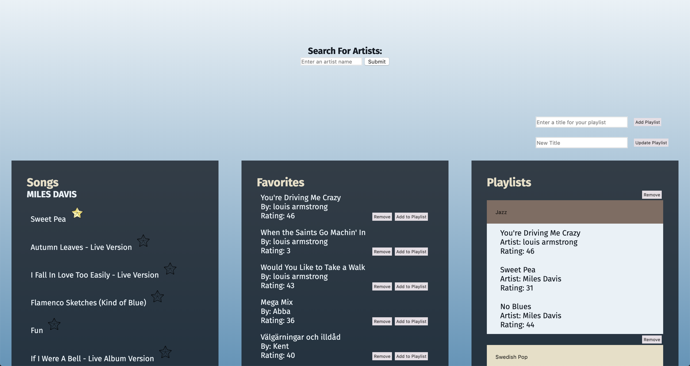

# Play

## Introduction
Play is a paired project for Module 4 of the [Back-End Engineering Program](https://turing.io/programs/back-end-engineering/) at the [Turing School of Software & Design](https://turing.io/). The project specifications can be found [here](http://backend.turing.io/module4/projects/play/play). Play is a full-stack application built using a Node.js backend with an Express server and a JavaScript frontend. It also calls the MusixMatch API to retrieve song information. [This repo](https://github.com/asmolentzov/play_fe) is the Play FE. You can find the [backend repo here](https://github.com/asmolentzov/play_be).

[Deployed Frontend Site](https://asmolentzov.github.io/play_fe/)

[Deployed Backend API](https://morning-island-25788.herokuapp.com)

[Project Board](https://waffle.io/asmolentzov/play_be)



## Endpoints
Visitors to the Play app can search for artists, which returns a list of songs by that artist:


They can then "star" or favorite those songs:


That will store the songs as "favorites", at which point a user can add them to a playlist or remove them as favorites:

# Need to add info about playlists here once complete

## Initial Setup
To install this project on your local machine:
1. Clone the repo to your machine:
```
git clone git@github.com:asmolentzov/play_fe.git
```
2. Change into the new directory.
3. Install dependencies:
```
npm install
```
4. Sign up for a [MusixMatch API Key](https://developer.musixmatch.com/).

5. Create a `.env` file in the root directory. You will need to add your MusixMatch API Key to the `.env` file in the following format:
```
MUSIXMATCH_API_KEY=<your api key>
```
6. Build:
```
npm build
```

## Running the Server Locally
To run the code locally, use the following command to start the development server:
```
npm run devstart
```
Once running, point your browser to:
```
http://localhost:8080/
```
# This part will need updating:
Currently the base URL for the backend is set to run using a locally deployed backend. You can point it to either the [deployed backend](https://morning-island-25788.herokuapp.com/) or [pull down and run the backend](https://github.com/asmolentzov/play_be) locally also.  

## How to Contribute
If you wish to contribute to this repo, you are welcome to make a PR and we would be happy to review it.


## Built With
* [JavaScript](https://www.javascript.com/)
* [Express](https://expressjs.com/)
* [Waffle](https://waffle.io/)
* [Webpack](https://webpack.js.org/)

## Authors
**[Lance Taylor](https://github.com/lptaylor)**

**[Anna Smolentzov](https://github.com/asmolentzov)**
