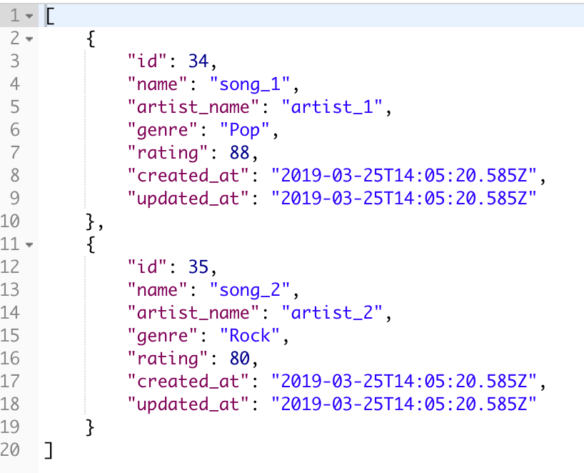
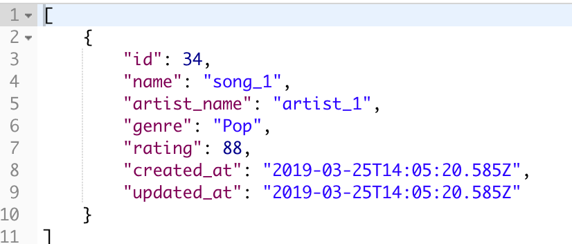
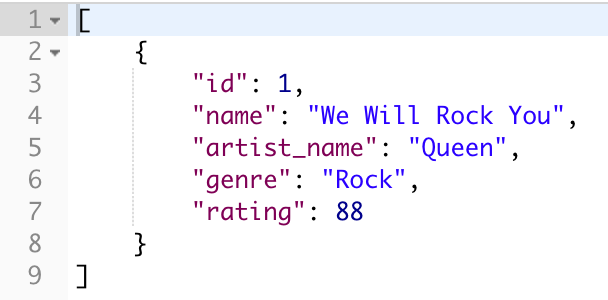
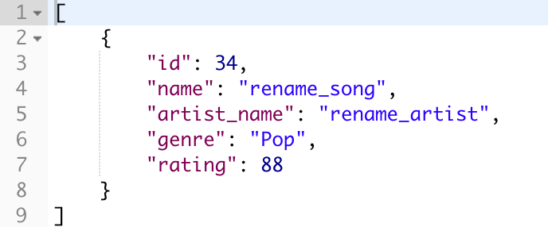
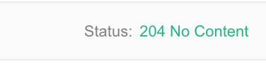
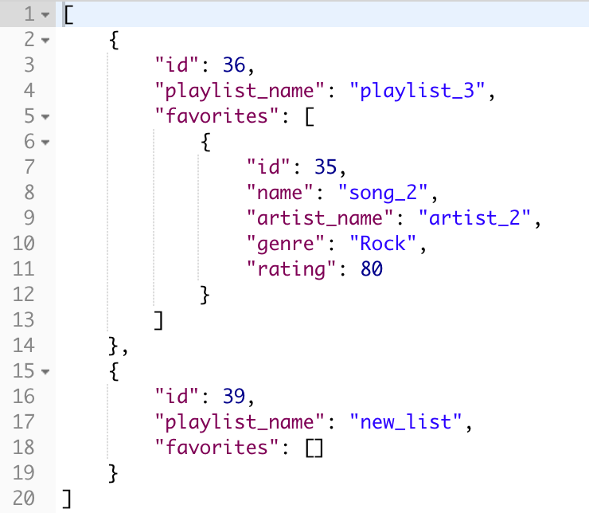
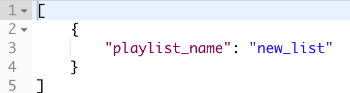
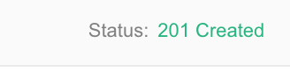
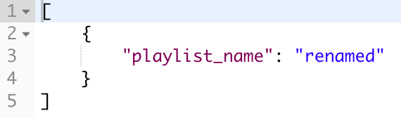

# Play

## Introduction
Play is a paired project for Module 4 of the [Back-End Engineering Program](https://turing.io/programs/back-end-engineering/) at the [Turing School of Software & Design](https://turing.io/). The project specifications can be found [here](http://backend.turing.io/module4/projects/play/play). Play is a full-stack application built using a Node.js backend with an Express server and a JavaScript frontend. The API has full CRUD functionality built in. Additionally, this repository uses the MVC design pattern for clarity and maintainability and includes a test suite built with Mocha and Chai. Finally, the frontend also calls the MusixMatch API to retrieve song information more information on how to set that up is found on the frontend documentation. [This repo](https://github.com/asmolentzov/play_be) is the Play BE. You can find the [frontend repo here](https://github.com/asmolentzov/play_fe).

[Deployed Frontend Site](https://asmolentzov.github.io/play_fe/)

[Deployed Backend API](https://morning-island-25788.herokuapp.com)

[Project Board](https://waffle.io/asmolentzov/play_be)

## Frontend Example


## Initial Setup
To install this project on your local machine:
1. Clone the repo to your machine:
```
git clone git@github.com:asmolentzov/play_be.git
```
2. Change into the new directory.

3. Install Node.js on your local machine.

4. Install dependencies:
```
npm install
```
## Running the Server Locally
To run the code locally, use the following command to start the development server:
```
npm run devstart
```
Once running, point your browser to:
```
http://localhost:3000/
```

## Endpoints for the API
Below are all the Endpoints with examples of the responses that can be used with this API and are called on the Frontend.

Additionally, a CORS package has been added to allow you to consume this API without CORS errors.

The frontend for this app and it's documentation can be found at github.com/asmolentzov/play_fe

### GET /api/v1/favorites

### GET /api/v1/favorites/:id

### POST /api/v1/favorites

### PUT /api/v1/favorites/:id

### DELETE /api/v1/favorites/:id

### GET /api/v1/playlists

### GET /api/v1/playlists/:playlist_id/favorites

### POST /api/v1/playlists

### POST /api/v1/playlists/playlist_id/favorites/id

### PUT /api/v1/playlists/:id

### DELETE /api/v1/playlists/:id


## How to Contribute
If you wish to contribute to this repo, you are welcome to make a PR and we would be happy to review it. Please use the Pull Request Template that has been included with all appropriate fields filled in.


## Built With
* [JavaScript](https://www.javascript.com/)
* [Express](https://expressjs.com/)
* [Waffle](https://waffle.io/)
* [Node](https://nodejs.org)
* [Knex](https://knexjs.org/)
* [PostgreSQL](https://www.postgresql.org/)
* [Chai](https://www.chaijs.com/)
* [Mocha](https://mochajs.org/)

## Authors
**[Lance Taylor](https://github.com/lptaylor)**

**[Anna Smolentzov](https://github.com/asmolentzov)**
